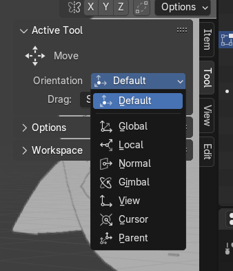
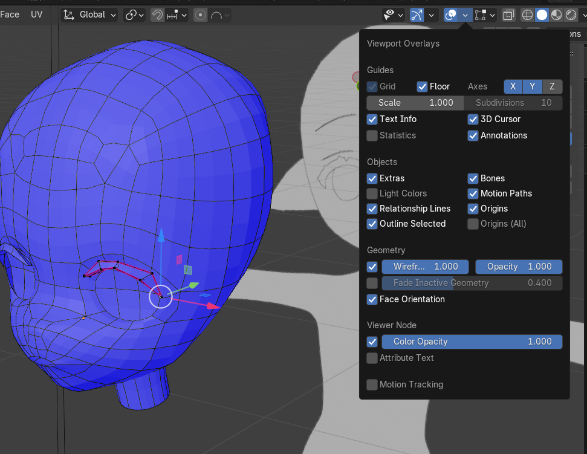
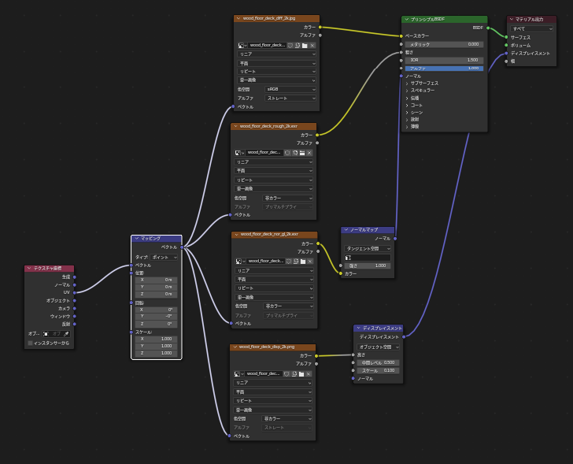
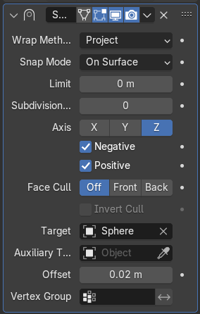
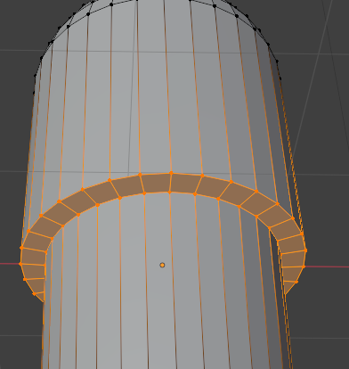

# about_xr

xr関連の色々なものを置く場所

# Cluster

## [WorkShop - アーカイブコンテンツ](https://www.workshop.cluster.mu/beginner)

| title | status | leaning | 
| :---- | :----- | :----- |
| 自分の部屋を作ろう！#1 | complete | |
| 自分の部屋を作ろう！#2 | complete | |
| 自分の部屋を作ろう！#3 | complete | pixel lightは2つまで。directional lightをのぞくと1つだけ。 |
| 自分の部屋を作ろう！#4 | complete | |
| 自分の部屋を作ろう！#5 | progress | Ridable Item, Mixamo |

# モデリング

## ざっくりとした流れ

+ 形を作る
  + メッシュをいじって作りたいものの形を整える
+ UV展開する
  + スケールを適用
  + シームつける
  + 展開
+ テクスチャ作る
  + UVマップの大きさをそろえる
  + 画像を作る
  + 貼り付ける
+ FBXエクスポート
  + Clusterの動画を参考にエクスポート
+ Unityに取り込む
  + FBXのディレクトリごと取り込んで配置

## 技術メモ

### ちょろいやつ

| やること | 操作 |
| :----- | :----- |
| オブジェクトを結合する | `Ctrl + J` |
| サブディビジョンサーフェイス追加 | `Ctrl + 2` |
| 回転リセット | `Alt + R` |
| loop tools導入 | 4.2はエクステンションから追加 |
| マテリアルリンクショートカット | `Crrl + L` |
| モディファイア適用 | モディファイア上で`Crrl + A` |
| 選択中のメッシュ以外非表示 | オブジェクトを選択して`Shift + H`。表示は`Alt + H` |
| 辺や面の分割 | `Alt + M` |
| 辺の頂点追加 | 右クリック -> 細分化 |
| 3Dカーソルを座標原点へ移動 | `Shift + C` |
| 繰り返し | `Shift + R` |
| 平行投影 <-> 透視投影 | `Num_5` |
| 重複頂点の結合 | 編集モードで`M` -> remove doubles |
| クリース掛ける | 編集モードで`Shift + E` -> ドラッグ |
| 辺のメニュー | `Crtl + E` |
| 法線のメニュー | `Alt + N` |
| 面の法線方向を反転 | 法線メニューのFlip |
| メッシュ透過 | `Alt + Z` |
| 法線にそって拡大縮小 | `Alt + S` |

### カーソルに関する情報

+ [Blenderのオブジェクトの概念（3Dカーソル・原点・ピボットポイント）を見てみよう](https://gihyo.jp/article/2023/03/blender-basics-06)

法線方向の移動はギズモ(?)使う

### メッシュに関する情報

+ 球体の面分割は4の倍数
+ ベベルに関しては奇数差し込み

面の作成は[F2](https://saru-blender.com/fill)を使ったりする

面の法線方向確認はFace Orientation使う

### UV展開に関する情報

 + [【完全版】blender初心者はコレさえ見ればUV展開できます【お題：フグ】](https://youtu.be/mFJNdIKApPc?si=1c74L4tA2yzt3NAO)

### テクスチャに関する情報源

| 種類 | 概要 |
| :----- | :----- |
| デュフューズマップ | 色や模様をつける |
| ラフネスマップ | 画像の粗さをつける。色空間に注意 |
| ノーマルマップ | 凹凸をつける。RGBがXYZとして保存される。 |
| ディスプレイスメントマップ | モデルを変形させるマップ。画像の濃淡が高さに変換される。 |

Node Wranglerの`Ctrl + Shift + T`で一括ノード追加

+ [Poly Heaven](https://polyhaven.com/)
+ [実は簡単！テクスチャでリアルな質感を作る方法【Blender】](https://youtu.be/K1MMnQjvzZ8?si=0IOpBbRIHsu0aba3)

### SVG取り込み & 実体化

[IllustratorのパスをBlenderで立体化する](https://styly.cc/ja/tips/jp-illustrator-to-blender/)

### プレーンを貼り付ける

Modifier -> Shrinkwrapを利用する。

[【Blenderチュートリアル】ステッカーの貼り方 曲面、球、角にも対応！](https://youtu.be/PG7zuOHJUS4?si=RKcdE839pjp0JSsL)

### ループ同士に面を張る

Ctrl + E -> Bridge Edge Loop

# キャラクタモデリング

+ [Blenderでキャラクターモデル制作！01 | 顔のモデリング（前編）〜初級から中級者向けチュートリアル〜](https://youtu.be/pk8POJpBkVs?si=3Kx54Zfmz_CR6lve)