# about_xr

xr関連の色々なものを置く場所

# Cluster

## [WorkShop - アーカイブコンテンツ](https://www.workshop.cluster.mu/beginner)

| title | status | leaning | 
| :---- | :----- | :----- |
| 自分の部屋を作ろう！#1 | complete | |
| 自分の部屋を作ろう！#2 | complete | |
| 自分の部屋を作ろう！#3 | complete | pixel lightは2つまで。directional lightをのぞくと1つだけ。 |
| 自分の部屋を作ろう！#4 | complete | |
| 自分の部屋を作ろう！#5 | complete | Ridable Item, Mixamo |
| 自分の島を作ろう！ #1 | complete | |
| 自分の島を作ろう！ #2 | complete | Terrainの使い方(ぼこぼこにする、木や草をはやす) |
| [自分の島を作ろう！ #3](https://youtu.be/8gTQ2j0u-xM?si=paz3ws8l13r04m3B) | complete | [BOOTH](https://booth.pm/ja)からの素材導入、PrefabのUnity Package化 |
| [自分の島を作ろう！#4](https://youtu.be/l0_YT53d-Ho?si=K3vSmhFYSXDTBvvO) | complete | stats -> Audio.levelを見ながらBGM調整(-50dbぐらい)。On Join Player Trigger |
| [自分の島を作ろう #5](https://youtu.be/UDYKYPnJe14?si=QaSZWvH0boBqQTPW) | complete | grabbable item, on release item trigger, add instant force, item logic, use item trigger, grab point |
| [自分の島を作ろう！#6](https://youtu.be/VFXEnfMT98s?si=o_S4tgKiGK_hLXBb) | complete | Animationの使い方 |
| [ゲームを作ろう！ #1](https://www.youtube.com/live/NVzIqM1Oabo?si=oW5pe8bTnH1ZKUdv) | complete | |
| [ゲームを作ろう！ #2](https://www.youtube.com/live/SQEHSCBUAOM?si=MuTxML94MGz0LJeP) | progress | Interact Item Trigger , Create Item Gimmick |
| [ゲームを作ろう！ #3](https://www.youtube.com/live/zbhGqFSesCA?si=_0P7KhpJE_rGu-Fh) | |

component - trigger

| name | description |
| :----- | :----- |
| On Create Item Trigger | アイテム作られたときに発火 |
| On Release Item Trigger | アイテムを離したときに発火 |
| Interact Item Trigger | |
| On Collide Item Trigger | アイテムが何かにぶつかったときに発火 |

component - gimmick 

| name | description |
| :----- | :----- |
| Destory Item Gimmick | アイテムを削除する。他のイベントと連動させて利用する。 |
| Create Item Gimmick | アイテムを作成する。Destory Item Gimmickと併せて利用する。 |

component - effect

| name | description |
| :----- | :----- |
| Add Instatn Force Item | アイテムに力を加える。他のイベントと連動させて利用する。 |
| Grabbable Item | 持てるようになる |

# モデリング

## ざっくりとした流れ

+ 形を作る
  + メッシュをいじって作りたいものの形を整える
+ UV展開する
  + スケールを適用
  + シームつける
  + 展開
+ テクスチャ作る
  + UVマップの大きさをそろえる
  + 画像を作る
  + 貼り付ける
+ FBXエクスポート
  + Clusterの動画を参考にエクスポート
+ Unityに取り込む
  + FBXのディレクトリごと取り込んで配置

## 技術メモ

### ちょろいやつ

| やること | 操作 |
| :----- | :----- |
| オブジェクトを結合する | `Ctrl + J` |
| サブディビジョンサーフェイス追加 | `Ctrl + 2` |
| 回転リセット | `Alt + R` |
| loop tools導入 | 4.2はエクステンションから追加 |
| マテリアルリンクショートカット | `Crrl + L` |
| モディファイア適用 | モディファイア上で`Crrl + A` |
| 選択中のメッシュ以外非表示 | オブジェクトを選択して`Shift + H`。表示は`Alt + H` |
| 辺や面の分割 | `Alt + M` |
| 辺の頂点追加 | 右クリック -> 細分化 |
| 3Dカーソルを座標原点へ移動 | `Shift + C` |
| 3Dカーソルを選択物へ移動 | `Shift + S` |
| 繰り返し | `Shift + R` |
| 平行投影 <-> 透視投影 | `Num_5` |
| 重複頂点の結合 | 編集モードで`M` -> remove doubles |
| クリース掛ける | 編集モードで`Shift + E` -> ドラッグ |
| 辺のメニュー | `Crtl + E` |
| 法線のメニュー | `Alt + N` |
| 面の法線方向を反転 | 法線メニューのFlip |
| メッシュ透過 | `Alt + Z` |
| 法線にそって拡大縮小 | `Alt + S` |
| XYZの軸に沿って拡大縮小 | `S -> Z -> 0` |
| 同一平面の選択 | `Shift + G` |

### カーソルに関する情報

+ [Blenderのオブジェクトの概念（3Dカーソル・原点・ピボットポイント）を見てみよう](https://gihyo.jp/article/2023/03/blender-basics-06)

法線方向の移動はギズモ(?)使う

3Dカーソルの表示/非表示

範囲カーソルなどの切り替えは`w`

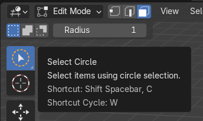

### 下絵に関する情報

Image -> Referenceで追加

透過の指定はここ

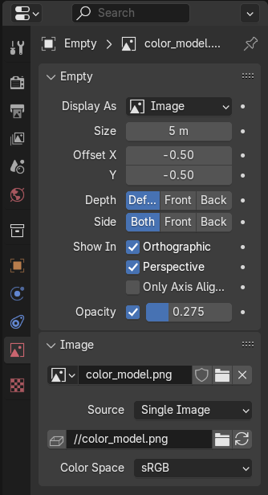

### メッシュに関する情報

+ 球体の面分割は4の倍数
+ ベベルに関しては奇数差し込み

面の作成は[F2](https://saru-blender.com/fill)を使ったりする

面の法線方向確認はFace Orientation使う

Force Fieldはメッシュと同様に`Shift + A`から追加

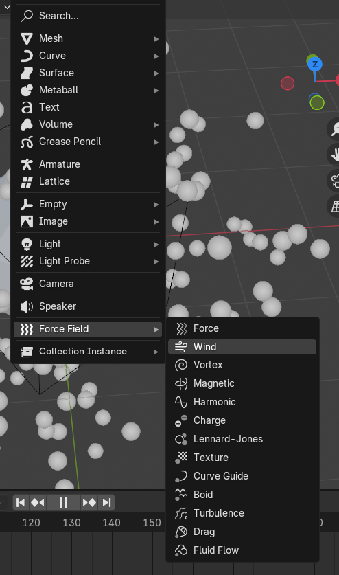

Force Fieldのプロパティはここ

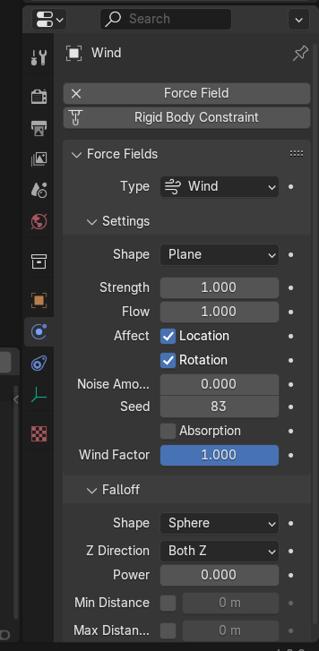

空洞を作りたいときは、2面を選択 -> 差し込み -> 右クリックからBridge Face

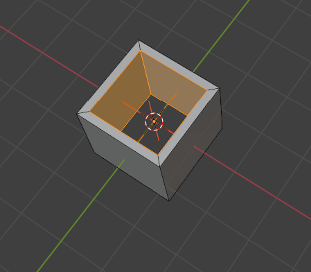

変形をパラメタとして保持したいときはShape Keysを利用する

<video src="./img/mesh_shape_keys.mp4" controls="true" width="600"></video>

### UV展開に関する情報

割り当て方向の反転は`S -> X -> -1` or `S -> Y -> -1`などでできる

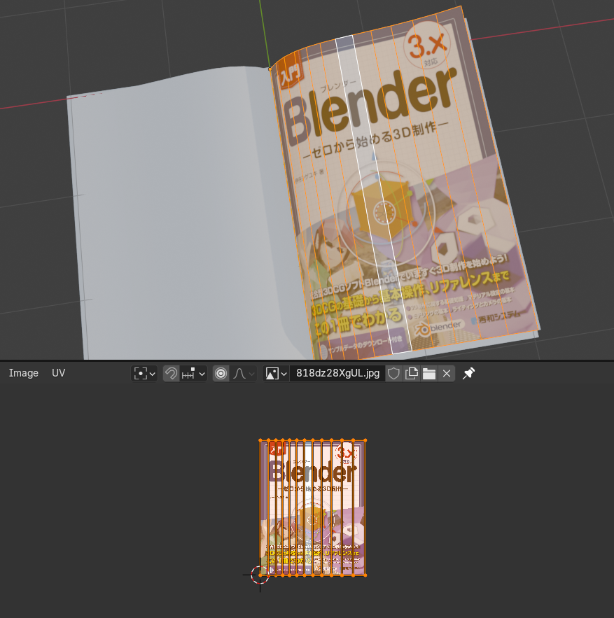

 + [【完全版】blender初心者はコレさえ見ればUV展開できます【お題：フグ】](https://youtu.be/mFJNdIKApPc?si=1c74L4tA2yzt3NAO)

### テクスチャに関する情報源

| 種類 | 概要 |
| :----- | :----- |
| デュフューズマップ | 色や模様をつける |
| ラフネスマップ | 画像の粗さをつける。色空間に注意 |
| ノーマルマップ | 凹凸をつける。RGBがXYZとして保存される。 |
| ディスプレイスメントマップ | モデルを変形させるマップ。画像の濃淡が高さに変換される。 |

Node Wranglerの`Ctrl + Shift + T`で一括ノード追加

+ [Poly Heaven](https://polyhaven.com/)
+ [実は簡単！テクスチャでリアルな質感を作る方法【Blender】](https://youtu.be/K1MMnQjvzZ8?si=0IOpBbRIHsu0aba3)
+ [BlenderでマテリアルをテクスチャにベイクしてUnityにインポート](https://youtu.be/dtdGN9v2l_I?si=i38TP3oiPYud9tSt)

### ボーンに関する情報

ボーンの方向変更

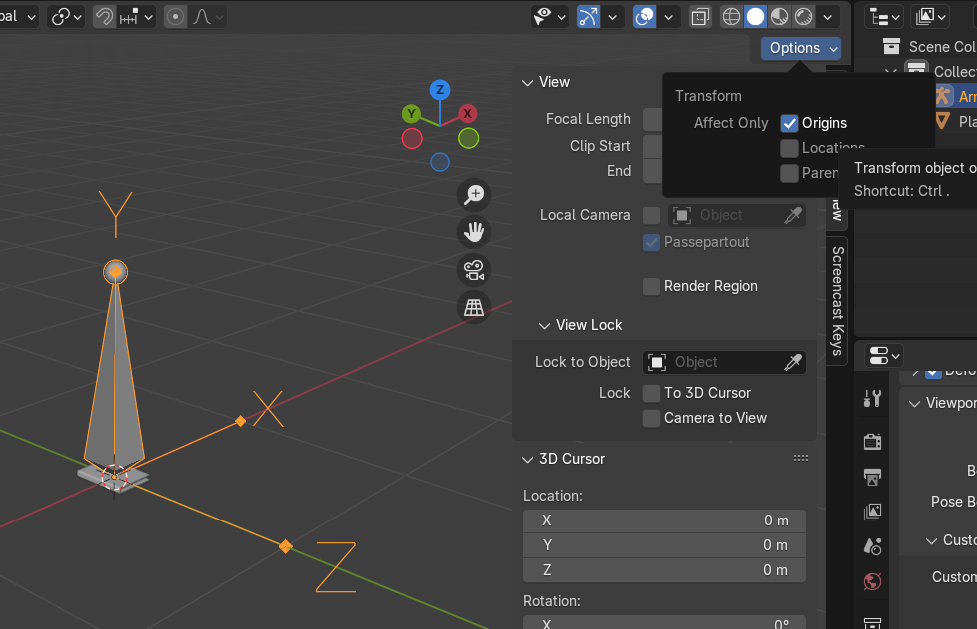

個別ボーンの回転はrollで設定

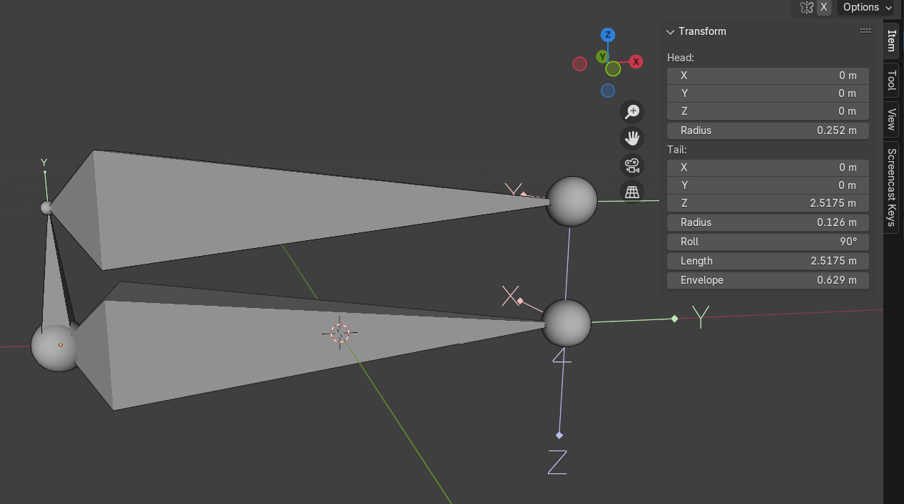

ウェイトの確認

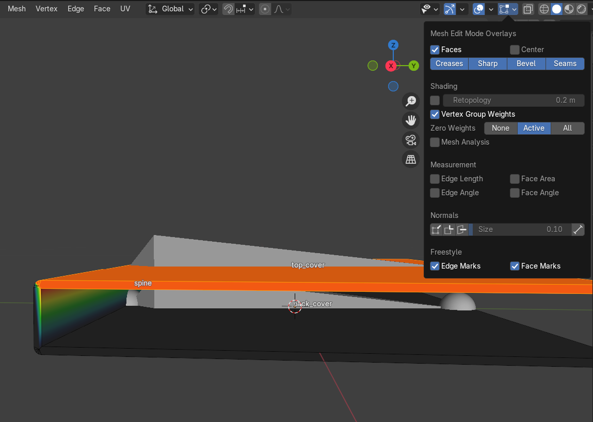

ポーズモードの切り替えはボーンを選択してから変更可能となる

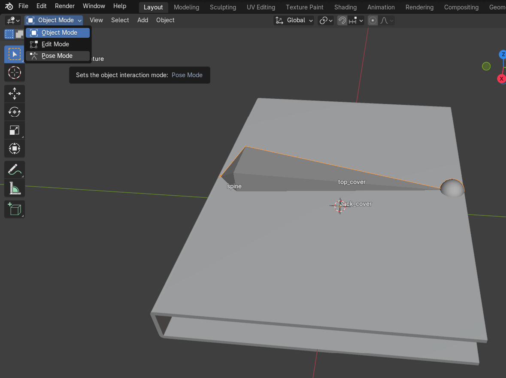

ボーン同士の制約はここから

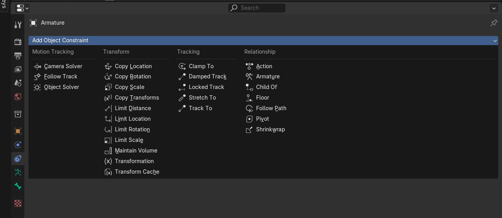

押し出し方向によってはアーマチュアのローカル座標方向が変わるので要注意

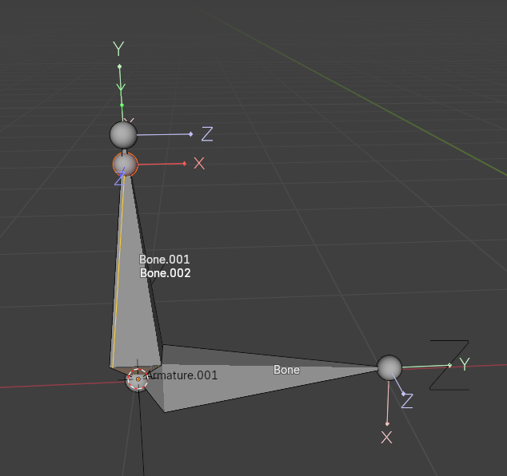

### SVG取り込み & 実体化

[IllustratorのパスをBlenderで立体化する](https://styly.cc/ja/tips/jp-illustrator-to-blender/)

### プレーンを貼り付ける

Modifier -> Shrinkwrapを利用する。

[【Blenderチュートリアル】ステッカーの貼り方 曲面、球、角にも対応！](https://youtu.be/PG7zuOHJUS4?si=RKcdE839pjp0JSsL)

### ループ同士に面を張る

Ctrl + E -> Bridge Edge Loop

### Modifier - Displacement

テクスチャに併せて凹凸をつける。テクスチャのDisplacementと同様。

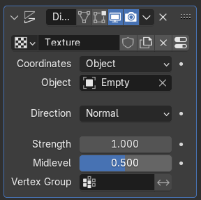

CoodinateをObjectにすると指定したオブジェクトに併せて凹凸が変わる。

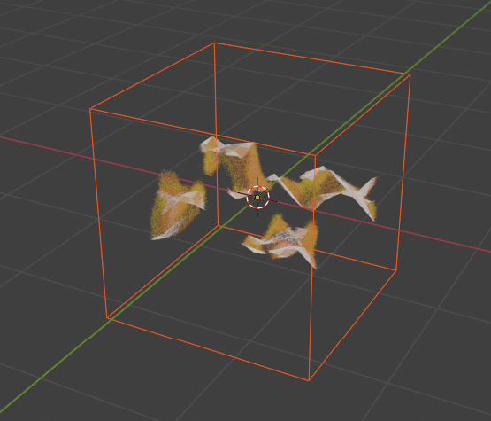

### Modifier - Simple Deform

どこかを起点にメッシュを曲げたりするモディファイア

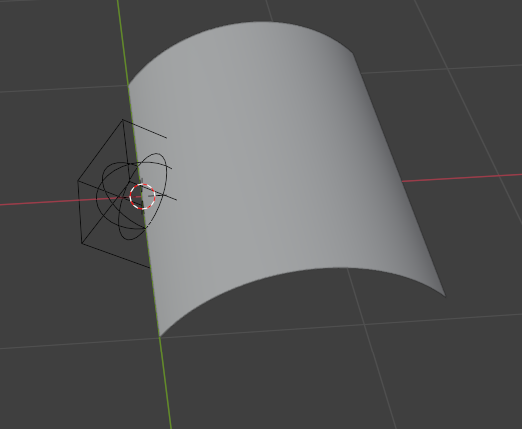

+ [Flipping Pages: Animation In Blender | Easy Step By Step Tutorial | Books | Magazines | Diaries etc.](https://youtu.be/ijRabIP8GnA?si=X9UIadab_uEo4uIK)
+ [【初心者でも出来る】本のモデリングとアニメーション！Blender2.93](https://youtu.be/zSb-xo7hfDY?si=iOzSj3Ee_Qbe67kQ)

### Modifier - Array

階段作るときに利用する。

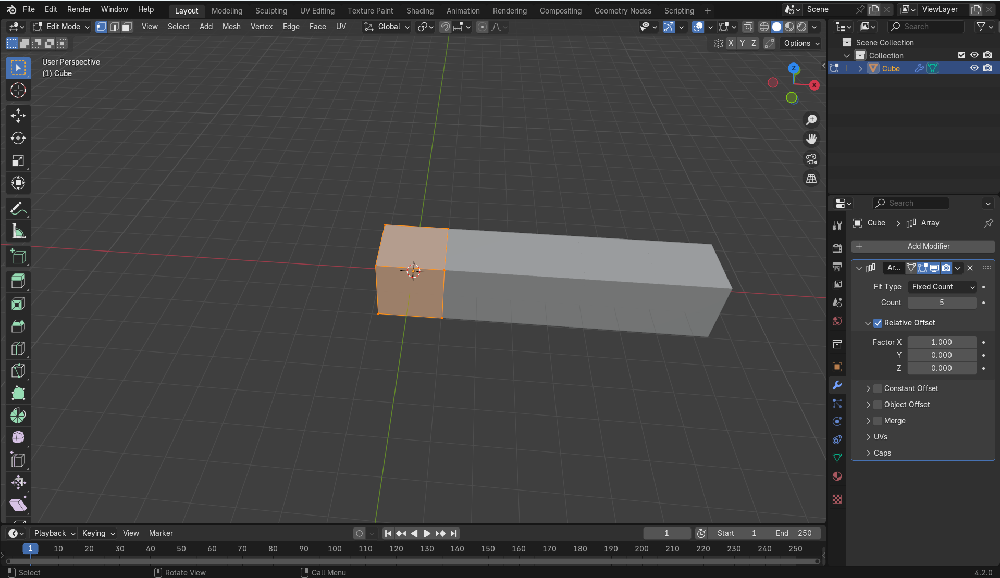

relative offseet

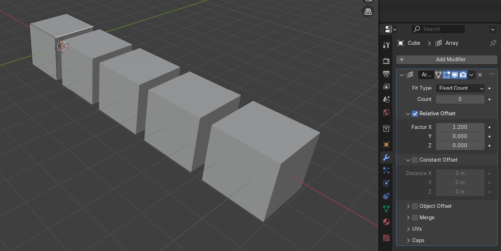

constraint offset

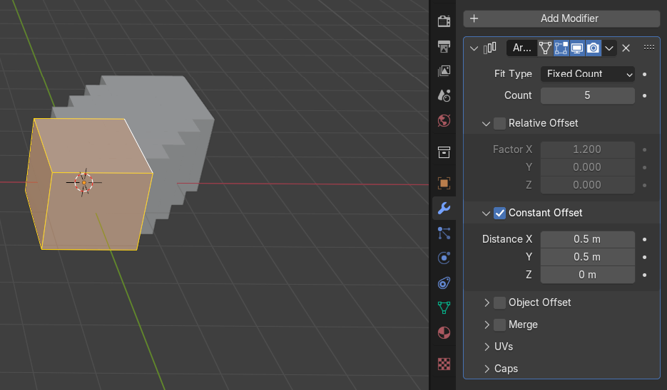

+ [Array（配列複製）モディファイア解説＆螺旋階段の作り方【blender2.9】](https://youtu.be/-_kqGQMDiNw?si=3pYhN417Cpsi5Mcz)

### Modifier - Deform

Curveを指定するとメッシュを沿わせられる。下記例はArrayとの組み合わせ。

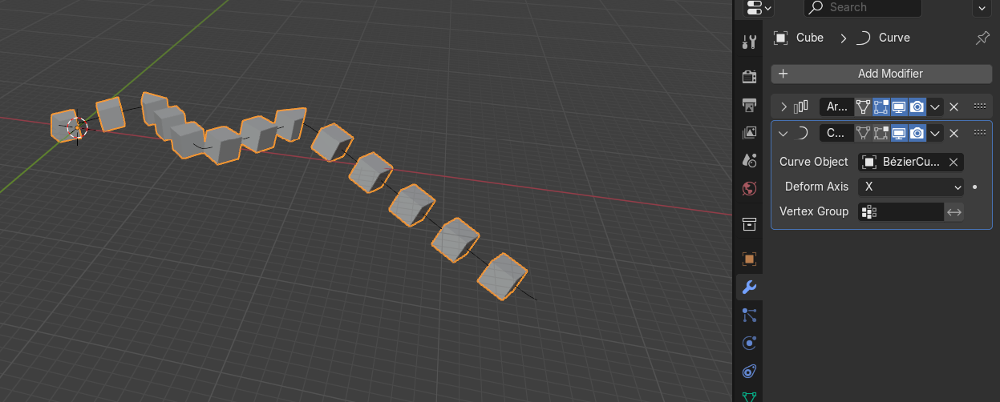

+ [Array（配列複製）モディファイア解説＆螺旋階段の作り方【blender2.9】](https://youtu.be/-_kqGQMDiNw?si=3pYhN417Cpsi5Mcz)

### Object Constraint - Pivot

回転の軸に制約をつける

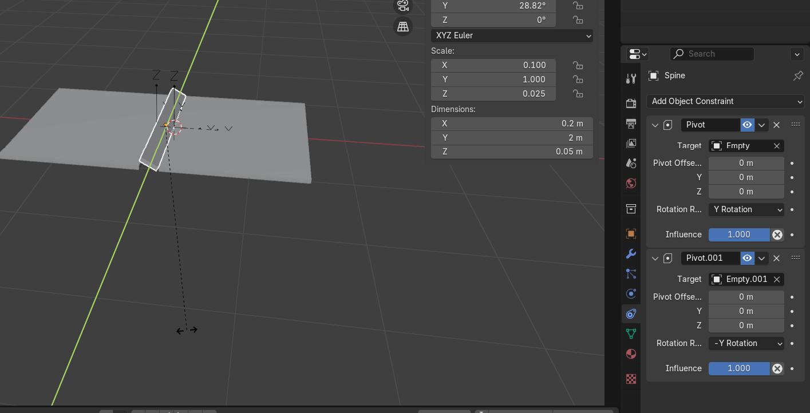

+ [【初心者でも出来る】本のモデリングとアニメーション！Blender2.93](https://youtu.be/zSb-xo7hfDY?si=zFMwFMy4qmLiFPmF)

### Object Constraint - Copy Rotation

回転の状態を別のオブジェクトから引き継ぐ

### Object Constraint - Limit Rotation

回転角に制限をつける

### Particle - new

このアイコン

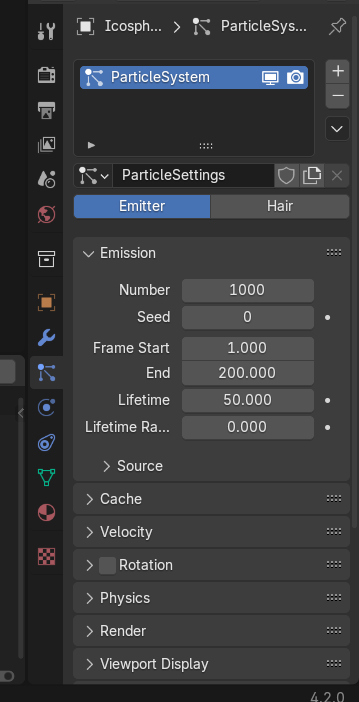

## 謎

特訓とかで触ったけど、なんねこれ状態の奴

### Render - View Transform

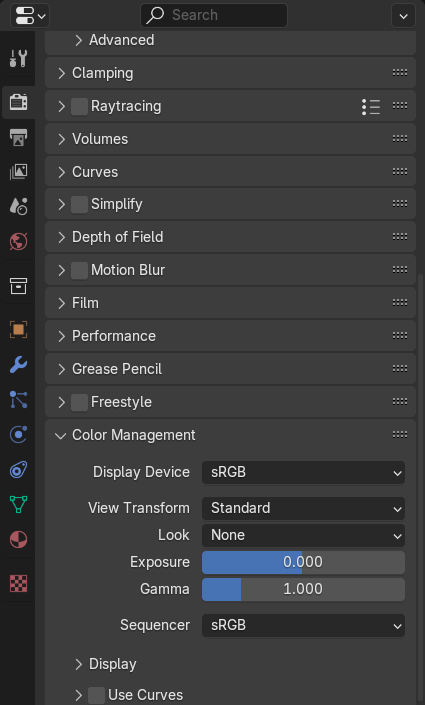

# キャラクタモデリング

+ [Blenderでキャラクターモデル制作！01 | 顔のモデリング（前編）〜初級から中級者向けチュートリアル〜](https://youtu.be/pk8POJpBkVs?si=3Kx54Zfmz_CR6lve)

## 炎

リアルな炎はFLUID

Shader設定

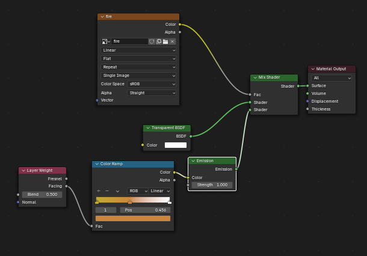

+ [【質問に答える】パーティクルで炎を作る【blender2.82】](https://youtu.be/430Ap8sbpYY?si=MN2-GLNVi028IkhJ)

# 参考サイト

特訓

+ [【blender 初心者】本の作り方を解説！](https://youtu.be/vPIiN_tk3Ck?si=ZPFrvMjAK8sxRkQU)

効果音

+ [OtoLogic](https://otologic.jp/free/se/doorbell01.html)
+ [効果音ラボ](https://soundeffect-lab.info/)

BGM

+ [DOAV- SYNDROME](https://dova-s.jp/se/play1337.html)